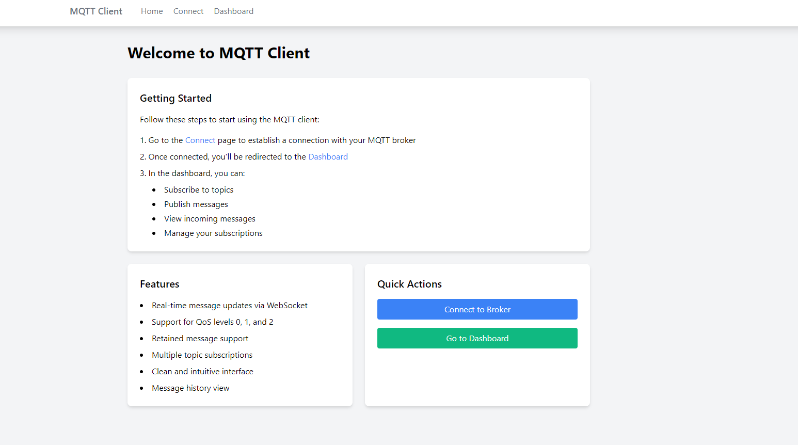
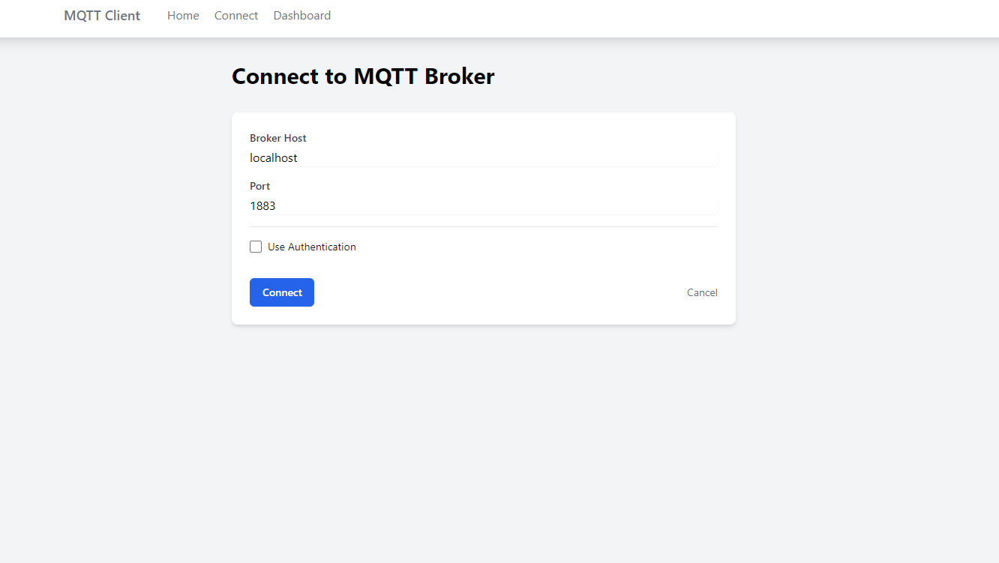
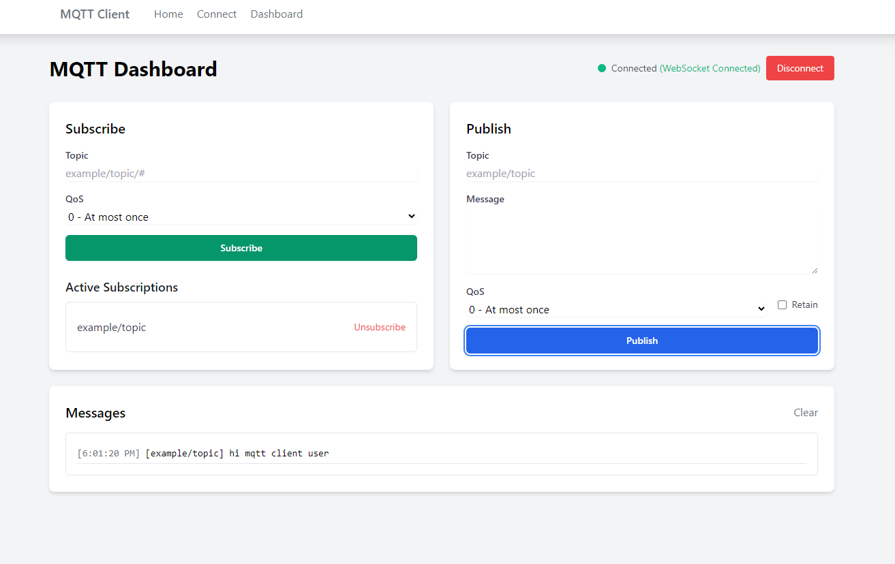

# MQTT Client Application

A web-based MQTT client application built with FastAPI and Python, providing a user interface for MQTT broker connections, message publishing, and topic subscriptions with real-time WebSocket updates.

## Features

- 🔌 Connect to MQTT brokers
- 📝 Publish messages to topics
- 📩 Subscribe to topics
- 🔄 Real-time updates via WebSocket
- 🎨 Clean web interface
- 🐳 Docker support

Screenshots

*Home Page*



*MQTT Broker Connection Interface*



*Main Dashboard with Publish/Subscribe Features*




## Prerequisites

- Docker and Docker Compose
- MQTT Broker (e.g., Mosquitto)

## Quick Start with Docker

1. Clone the repository:
```bash
git clone <your-repository-url>
cd mqtt-client-app
```

2. Configure environment variables:
```bash
# .env
MQTT_BROKER_HOST=host.docker.internal
MQTT_BROKER_PORT=1883
MQTT_USERNAME=your_username  # Optional
MQTT_PASSWORD=your_password  # Optional
API_HOST=0.0.0.0
API_PORT=8000
```

3. Build and run with Docker Compose:
```bash
docker-compose up -d --build
```

The app will be available at: `http://localhost:8000`

## Local Development

1. Create virtual environment:
```bash
python -m venv venv
source venv/bin/activate  # Windows: venv\Scripts\activate
pip install -r requirements.txt
```

2. Run the app:
```bash
uvicorn app.main:app --reload --host 0.0.0.0 --port 8000
```

## API Routes

- `GET /`: Home page
- `GET /connect`: Connection page
- `GET /dashboard`: Dashboard
- `POST /api/connect`: Connect to broker
- `POST /api/disconnect`: Disconnect
- `POST /api/subscribe`: Subscribe to topic
- `POST /api/unsubscribe`: Unsubscribe
- `POST /api/publish`: Publish message
- `GET /api/connection-status`: Connection status
- `WebSocket /ws`: Real-time updates

## Testing

```bash
pytest
```

## License

MIT License - see the [LICENSE](LICENSE) file for details.